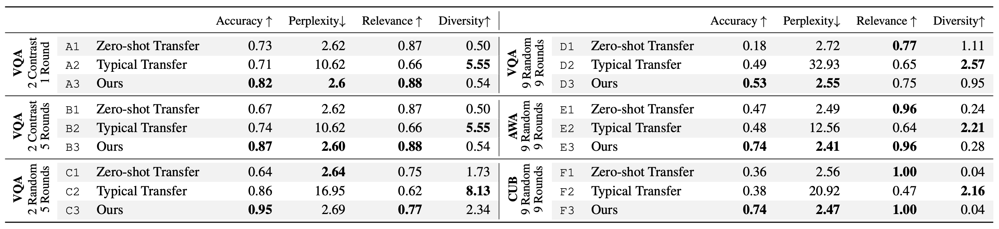

This is the code used to implement experiments from the paper
"Dialog without Dialog Data: Learning Visual DialogAgents from VQA Data".
It defines the models proposed in that paper and provides training and evaluation
code for the results reported in the paper.

# Software Versions

This repository was designed with Python 3.6.8 and PyTorch 1.3.

See the `environment.yml` file for a detailed specification of the
software used to run these experiments. This file can be used to create
a conda environment by running `conda env create -f environment.yml`,
per the instructions [here](https://docs.conda.io/projects/conda/en/latest/user-guide/tasks/manage-environments.html#creating-an-environment-from-an-environment-yml-file).
You may want to change the `prefix` variable in that file to point to
the appropriate location.


# Pool Data Pre-Processing

Some pre-processing is need to create the data that specifies the pools
used for these experiments.

## VQA

```
$ python tools/generate_splits.py')
$ python tools/generate_pool.py')
```

## CUB

```
$ python tools/cub/generate_cub_meta.py # creates data/cub_meta.json
$ python tools/cub/generate_pool.py # creates pool candidates in data/cub_pool_info_v1.pkl
```

## AWA

```
$ python tools/awa/create_awa_meta.py # creates data/awa_meta.json
$ python tools/awa/generate_pool.py # creates pool candidates in data/awa_pool_info_v1.pkl
```


# Workflow

Experiments (i.e., different models) are specified with a code that looks like
`exp20.3.5.2`, parameterized by `<exp>` below.
Similarly, evaluation protocols are specified with a code that looks like
`eval4.2.3.1.3`, parameterized by `<eval>` below.

The workflow is to train models with

```
run.py -m train <exp>
```

and then evaluate them with

```
run.py -m analyze <exp> <eval>
```

Dialogs can also be visualized with

```
run.py -m visualize <exp> <eval>
```

Results are aggregated and analyzed in the `analysis.ipynb` notebook,
where you can see how latex tables for the final results are generated.

To do multiple stages of training we simply call `run.py -m train` multiple
times. Once for stage 1, again specifying a different model for stage 2.A,
and again specifying yet again a different model for stage 2.B.

## Experiment Codes


### Stage 1 (exp15)

```
<exp> = exp15.<var>.<speaker-type>
```

`<var>`

* 0 - (default) 128 4-way Concrete latent variables
* 1 - 512 dimensional Gaussian latent variable
* 2 - 512 dimensional latent variable (non-variational; i.e., it excludes the KL term of the ELBO)

`<speaker-type>`

* 0 - (default) for use with continuous latent variables
* 1 - for use with discrete latent variables

### Stage 2.A and Stage 2 (exp19)

```
<exp> = exp19.<pool-type>.<ablation>.<dataset>.<initial-model>
```

`<pool-type>`

* 0 - (default) 2 Contrast 5 Rounds
* 1 - 2 Random 5 Rounds
* 2 - 4 Random 5 Rounds
* 3 - 9 Random 9 Rounds

`<freeze>`

* 0 - (default) Freeze the Question Policy and the Speaker (decoder)
* 1 - Fine-tune everything including the Speaker. (Uses question decoder logits to parameterize one Concrete variable per word to allow gradients to flow through words.)
* 2 - Parallel speaker baseline
* 3 - Freeze the Speaker (decoder), but not the Question Policy (for Stage 2 results)

`<dataset>`

* 0 - (default) VQA
* 1 - CUB
* 2 - AWA

`<initial-model>`

* 1 - Discrete latent variable model (exp15.0.1)
* 3 - Gaussian latent variable model (exp15.1.0)
* 4 - Non-variational continuous baseline (exp15.2.0)

### Stage 2.B (exp20)

```
<exp> = exp20.<pool-type>.<initial-model>.<dataset>
```

`<pool-type>`

* 0 - (default) 2 Contrast 5 Rounds
* 1 - 2 Random 5 Rounds
* 2 - 4 Random 5 Rounds
* 3 - 9 Random 9 Rounds

`<initial-model>`

* 2 - Discrete latent variable model (exp15.0.1)
* 4 - Gaussian latent variable model (exp15.1.0)
* 5 - Non-variational continuous baseline (exp15.2.0)

`<dataset>`

* 0 - (default) VQA
* 1 - CUB
* 2 - AWA


## Evaluation Codes

This specifies how to compute the final metrics.
It computes all metrics reported in the paper, including accuracy,
perplexity, relevance, and diversity.

```
<eval> = eval4.<pool-type>.0.<stop>.<dataset>
```

`<pool-type>`

* 0 - (default) 2 Contrast 5 Rounds
* 1 - 2 Random 5 Rounds
* 2 - 4 Random 5 Rounds
* 3 - 9 Random 9 Rounds

`<stop>`

* 1 - Stop after epoch 20 for a stage 1 or stage 2.A experiment. Stop at epoch 5 for a stage 2.B experiment.

`<dataset>`

* 0 - (default) VQA
* 1 - CUB
* 2 - AWA


# Results

Our main results are reported in Table 1 of the paper and reproduced in the
following figure.



The above commands and experiment codes can be used to train and analyze the same models reported in this paper.

* Note: Row D2 of the above table was an outlier in previous versions of the
table. In running some of our analysis again we found an error in this row
and provide an updated version in the current version of the table shown above.
The updated version is more consistent with the trends we observed in the rest
of the table.
